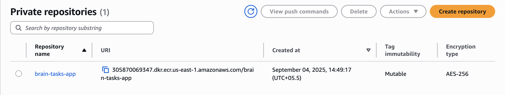
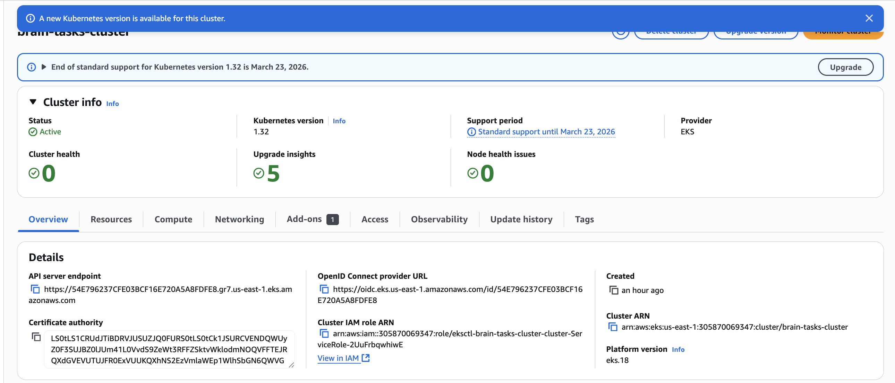
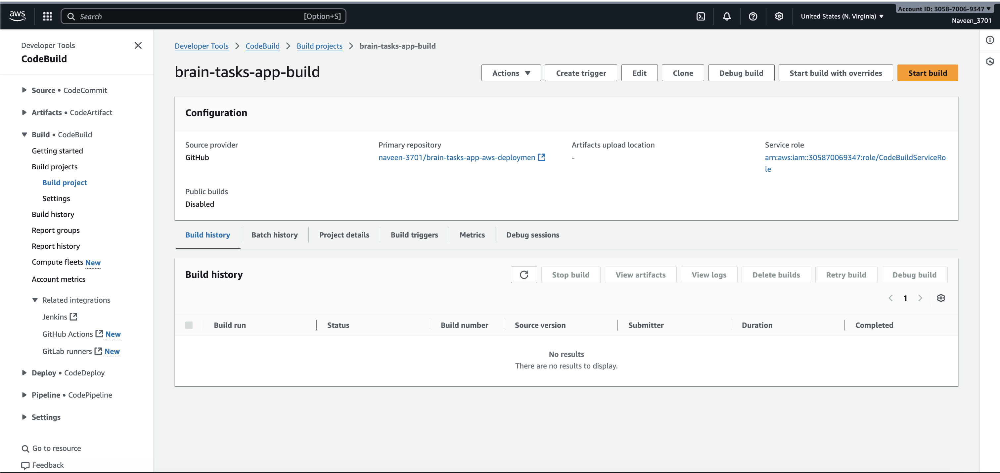
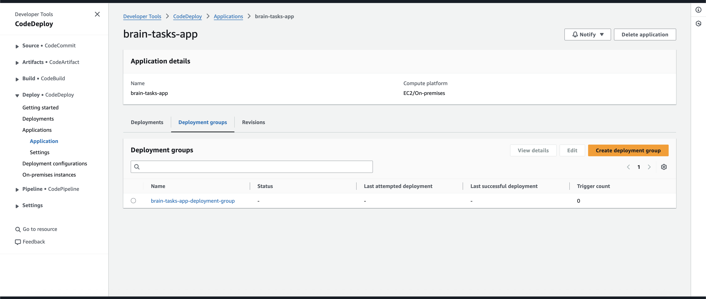
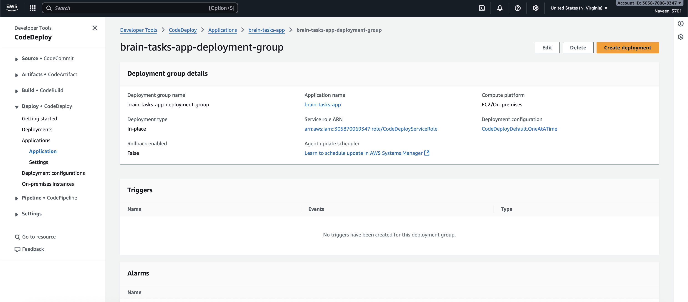
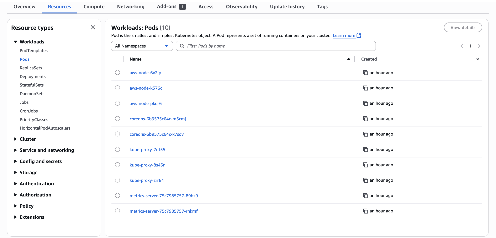
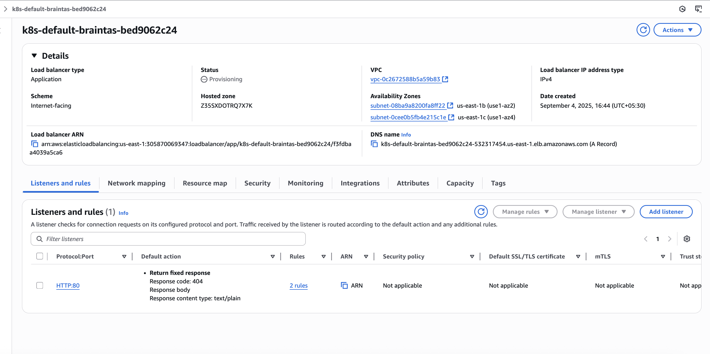

# Brain Tasks App - AWS EKS Deployment

A complete production-ready deployment of a React application on AWS EKS with full CI/CD pipeline using Docker, ECR, CodeBuild, CodeDeploy, and CodePipeline.

## 🎯 Project Overview

This project demonstrates a complete DevOps workflow for deploying a React application to AWS EKS with the following components:

- **Docker Containerization** with nginx
- **AWS ECR** for container image storage
- **AWS EKS** for Kubernetes orchestration
- **AWS Load Balancer** for public access
- **AWS CodeBuild** for automated builds
- **AWS CodeDeploy** for deployment automation
- **AWS CodePipeline** for CI/CD orchestration
- **CloudWatch** for monitoring and logging

## 🌐 Live Application

**Application URL**: http://k8s-default-braintas-bed9062c24-532317454.us-east-1.elb.amazonaws.com

**Load Balancer ARN**: `k8s-default-braintas-bed9062c24-532317454.us-east-1.elb.amazonaws.com`

## 📋 Prerequisites

Before running the deployment, ensure you have the following installed:

- **AWS CLI** v2.x
- **kubectl** v1.28+
- **eksctl** v0.150+
- **Docker** v20.10+
- **Helm** v3.12+
- **Git** v2.30+

### Installation Commands

```bash
# macOS (using Homebrew)
brew install awscli kubernetes-cli eksctl docker helm git

# Ubuntu/Debian
sudo apt update
sudo apt install -y awscli kubectl docker.io git
curl -fsSL https://github.com/eksctl-io/eksctl/releases/latest/download/eksctl_$(uname -s)_amd64.tar.gz | tar xz -C /tmp
sudo mv /tmp/eksctl /usr/local/bin
curl https://raw.githubusercontent.com/helm/helm/main/scripts/get-helm-3 | bash
```

## 🚀 Quick Start

### 1. Clone the Repository

```bash
git clone https://github.com/naveen-3701/brain-tasks-app-aws-deploymen.git
cd brain-tasks-app-aws-deploymen
```

### 2. Configure AWS Credentials

```bash
aws configure
# Enter your AWS Access Key ID, Secret Access Key, and region (us-east-1)
```

### 3. Run the Complete Setup

```bash
# Make scripts executable
chmod +x aws/*.sh

# Run the master setup script
./setup.sh
```

This will automatically:
- Create ECR repository
- Set up EKS cluster
- Configure CodeBuild project
- Set up CodeDeploy application
- Create CodePipeline
- Deploy the application to EKS

## 📁 Project Structure

```
brain-tasks-app-aws-deploymen/
├── aws/                          # AWS infrastructure scripts
│   ├── setup-ecr.sh             # ECR repository setup
│   ├── setup-eks.sh             # EKS cluster setup
│   ├── setup-codebuild.sh       # CodeBuild project setup
│   ├── setup-codedeploy.sh      # CodeDeploy application setup
│   ├── setup-codepipeline.sh    # CodePipeline setup
│   └── aws-load-balancer-controller-policy.json
├── ci-cd/                        # CI/CD configuration files
│   ├── buildspec.yml            # CodeBuild build specification
│   ├── appspec.yml              # CodeDeploy application specification
│   └── deploy-eks.sh            # EKS deployment script
├── docker/                       # Docker configuration
│   ├── Dockerfile               # Production Docker image
│   ├── Dockerfile.simple        # Simplified Docker image
│   ├── nginx.conf               # Nginx configuration
│   └── docker-compose.yml       # Local development
├── k8s/                         # Kubernetes manifests
│   ├── namespace.yaml           # Application namespace
│   ├── deployment.yaml          # Application deployment
│   ├── service.yaml             # Kubernetes service
│   ├── ingress.yaml             # Load balancer ingress
│   └── ingress-simple.yaml      # Simplified ingress
├── images/                      # Screenshots and documentation
│   ├── docker-image.png         # Docker image in ECR
│   ├── ecr-repo.png             # ECR repository
│   ├── eks-cluster.png          # EKS cluster
│   ├── eks-pods.png             # Running pods
│   ├── load-balancer.png        # Load balancer
│   ├── code-build-project.png   # CodeBuild project
│   ├── code-deploy-application.png # CodeDeploy application
│   └── deployement-group.png    # Deployment group
├── setup.sh                     # Master setup script
├── local-dev.sh                 # Local development script
├── cleanup.sh                   # Resource cleanup script
└── README.md                    # This file
```

## 🔧 Manual Setup (Step by Step)

If you prefer to run each component individually:

### 1. ECR Repository Setup

```bash
./aws/setup-ecr.sh us-east-1
```



### 2. EKS Cluster Setup

```bash
./aws/setup-eks.sh brain-tasks-cluster us-east-1
```



### 3. CodeBuild Project Setup

```bash
./aws/setup-codebuild.sh brain-tasks-app-build us-east-1 305870069347.dkr.ecr.us-east-1.amazonaws.com/brain-tasks-app
```



### 4. CodeDeploy Application Setup

```bash
./aws/setup-codedeploy.sh brain-tasks-app brain-tasks-app-deployment-group us-east-1
```





### 5. CodePipeline Setup

```bash
./aws/setup-codepipeline.sh brain-tasks-app-pipeline us-east-1
```

### 6. Deploy to EKS

```bash
# Create namespace
kubectl create namespace brain-tasks-app

# Deploy application
kubectl apply -f k8s/

# Check deployment status
kubectl get pods -n brain-tasks-app
```



## 🐳 Docker Configuration

### Production Dockerfile

The application uses a multi-stage Docker build with nginx for serving static files:

```dockerfile
FROM nginx:1.25-alpine
COPY dist /usr/share/nginx/html
EXPOSE 80
CMD ["nginx", "-g", "daemon off;"]
```

### Local Development

```bash
# Build and run locally
./local-dev.sh

# Or manually
docker build -t brain-tasks-app .
docker run -p 3000:80 brain-tasks-app
```

## ☸️ Kubernetes Configuration

### Deployment

- **Replicas**: 3
- **Image**: ECR repository with latest tag
- **Resources**: 128Mi memory, 100m CPU (requests)
- **Health Checks**: Liveness and readiness probes

### Service

- **Type**: ClusterIP
- **Port**: 80
- **Target Port**: 80

### Ingress

- **Type**: AWS Application Load Balancer
- **Scheme**: Internet-facing
- **Health Check**: HTTP on port 80



## 🔄 CI/CD Pipeline

### Pipeline Stages

1. **Source**: GitHub repository (naveen-3701/brain-tasks-app-aws-deploymen)
2. **Build**: CodeBuild project with Docker build and ECR push
3. **Deploy**: CodeDeploy to EKS cluster

### Build Process

The `buildspec.yml` defines the build process:

```yaml
version: 0.2
phases:
  pre_build:
    commands:
      - aws ecr get-login-password --region $AWS_DEFAULT_REGION | docker login --username AWS --password-stdin $ECR_REPOSITORY_URI
      - REPOSITORY_URI=$ECR_REPOSITORY_URI
      - IMAGE_TAG=$(echo $CODEBUILD_RESOLVED_SOURCE_VERSION | cut -c 1-7)
  build:
    commands:
      - docker build -t $REPOSITORY_URI:$IMAGE_TAG -f docker/Dockerfile .
      - docker tag $REPOSITORY_URI:$IMAGE_TAG $REPOSITORY_URI:latest
  post_build:
    commands:
      - docker push $REPOSITORY_URI:$IMAGE_TAG
      - docker push $REPOSITORY_URI:latest
```

## 📊 Monitoring and Logging

### CloudWatch Integration

All components are configured to send logs to CloudWatch:

- **EKS Cluster Logs**: API server, audit, authenticator, controller manager, scheduler
- **Application Logs**: Container logs from nginx
- **Build Logs**: CodeBuild execution logs
- **Deployment Logs**: CodeDeploy deployment logs

### Health Checks

- **Load Balancer**: HTTP health check on port 80
- **Kubernetes**: Liveness and readiness probes
- **Application**: nginx serving static files

## 🔒 Security Features

### IAM Roles and Policies

- **CodeBuild Service Role**: Administrator access for builds
- **CodeDeploy Service Role**: ECS deployment permissions
- **CodePipeline Service Role**: Full CodePipeline access
- **Load Balancer Controller Role**: EC2 and ELB permissions

### Network Security

- **VPC**: Default VPC with public subnets
- **Security Groups**: Managed by EKS
- **Load Balancer**: Internet-facing with health checks

### Container Security

- **Image Scanning**: ECR vulnerability scanning enabled
- **Base Image**: Official nginx:alpine (minimal attack surface)
- **Non-root**: nginx runs as non-root user

## 💰 Cost Optimization

### Resource Sizing

- **EKS Nodes**: t3.medium instances (2 vCPU, 4GB RAM)
- **Node Count**: 3 nodes (minimum 1, maximum 4)
- **Load Balancer**: Application Load Balancer (pay-per-use)

### Estimated Monthly Costs

- **EKS Cluster**: ~$73/month
- **EC2 Instances**: ~$90/month (3x t3.medium)
- **Load Balancer**: ~$16/month
- **ECR**: ~$1/month (storage)
- **Total**: ~$180/month

## 🛠️ Troubleshooting

### Common Issues

1. **Pods in CrashLoopBackOff**
   ```bash
   kubectl logs <pod-name> --previous
   kubectl describe pod <pod-name>
   ```

2. **Load Balancer Not Accessible**
   ```bash
   kubectl get ingress
   kubectl describe ingress brain-tasks-app-ingress
   ```

3. **Build Failures**
   ```bash
   aws codebuild list-builds --project-name brain-tasks-app-build
   aws codebuild batch-get-builds --ids <build-id>
   ```

### Useful Commands

```bash
# Check cluster status
kubectl get nodes
kubectl get pods -A

# Check application status
kubectl get pods -n brain-tasks-app
kubectl get svc -n brain-tasks-app
kubectl get ingress

# View logs
kubectl logs -f deployment/brain-tasks-app -n brain-tasks-app

# Scale deployment
kubectl scale deployment brain-tasks-app --replicas=5 -n brain-tasks-app
```

## 🧹 Cleanup

To remove all AWS resources and avoid charges:

```bash
./cleanup.sh
```

This will delete:
- CodePipeline
- CodeDeploy application
- CodeBuild project
- ECR repository
- EKS cluster
- IAM roles and policies
- S3 buckets


**Deployment completed successfully!** 🎉

The React application is now running on AWS EKS with a complete CI/CD pipeline. Access it at: http://k8s-default-braintas-bed9062c24-532317454.us-east-1.elb.amazonaws.com